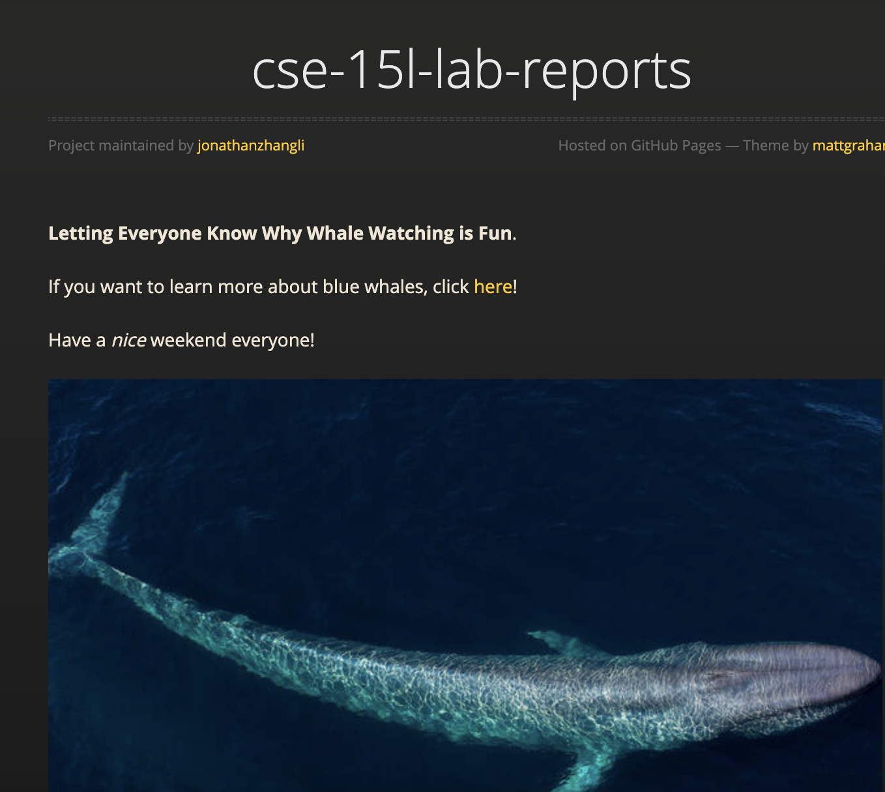

**Lab Report 1 Week 2**. 

# What I learned this week  
1. Using GitHub Pages
2. Using GitHub Desktop App
3. Relearning Markdown

Here is a screenshot of what I was able to do!

  

Have a _nice_ weekend!  