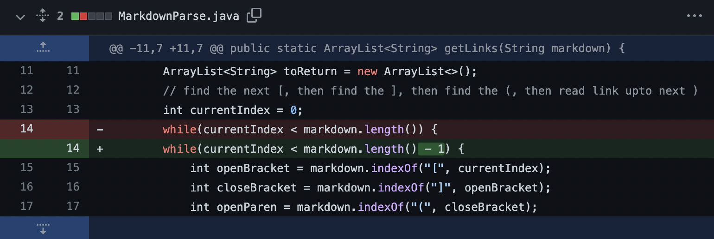
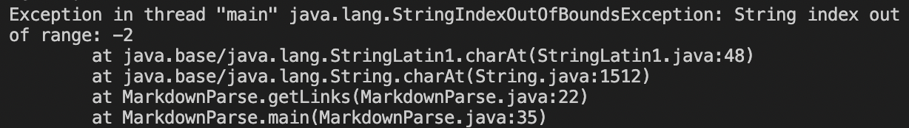
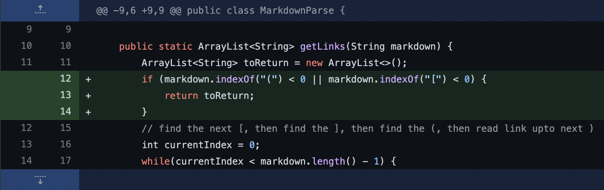
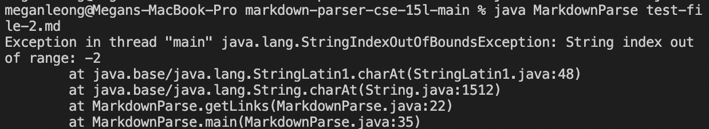
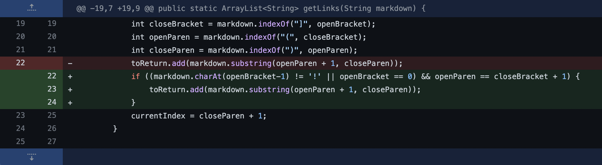
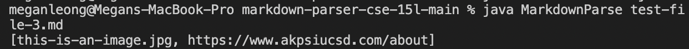

**Lab Report 2 Week 4**

# Bugs and Fixes 

## **Code Change #1**

Associated [Test File 1](https://github.com/jonathanzhangli/markdown-parser-cse-15l/blob/main/test-file-1.md?plain=1) that causes the bug

Error Output: 

Bug relationship: The initial code had a bug and was causing an index out of range error because it was trying to return a substring at an index that was greater than the inputted string length. To fix this, we changed the while loop to stop another index before the length of the string, which is the index of the last character of the link.

## **Code Change #2**

Associated [Test File 2](https://github.com/jonathanzhangli/markdown-parser-cse-15l/blob/main/test-file-2.md?plain=1) that causes the bug

Error Output: 

Bug relationship: The test file is empty, as in there are no links. Thus, the pahrentheses and brackets are never found because they are not in the test file. This causes the indexes of the open and close pahrentheses and brackets to be -1, which then causes an index out of bounds error when trying to return the substring at index -1.

## **Code Change #3**

Associated [Test File 3](https://github.com/jonathanzhangli/markdown-parser-cse-15l/blob/main/test-file-3.md?plain=1) that causes the bug

Error Output: 

Bug relationship: The initial code had a bug, where it would interpret images as links and print out the image file name as a link in the output. The test file’s first “link” is actually an image, which was still printed normally as a link. To fix this bug, we changed the code to detect if the link is an image by checking for “!”, and if so then it does not return it.

That's it! Have a _nice_ day!  