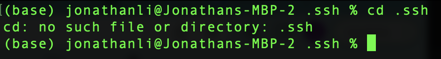
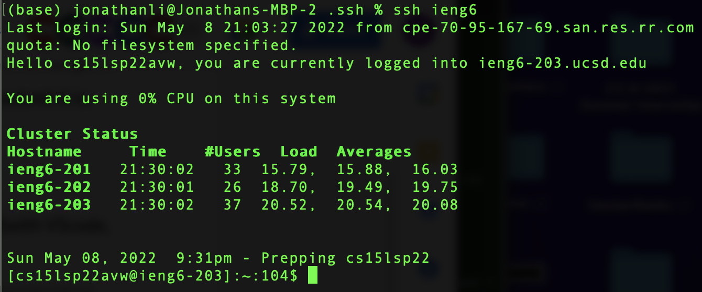
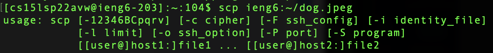
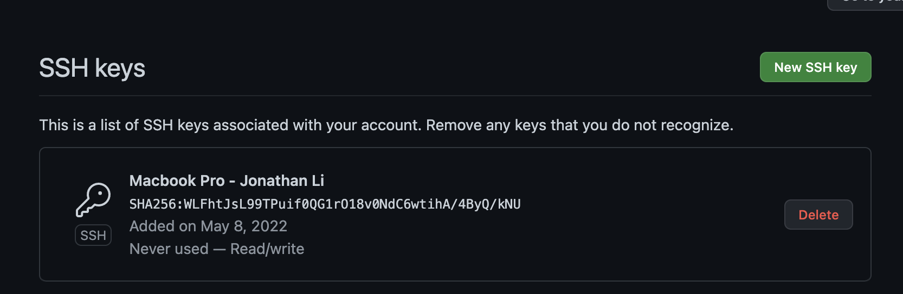
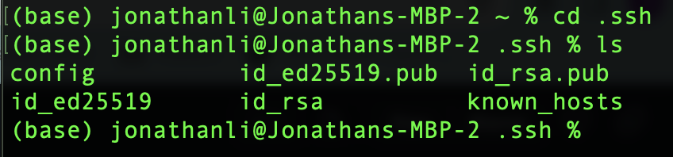
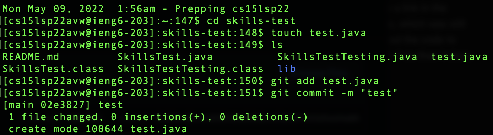

**Lab Report 3 Week 6**

# Bugs and Fixes 

## **Streamlining ssh Configuration**
- Showing .ssh/config file (step 1)

- Editing config file (step 1 part 2)

- Using the alias ssh (step 2)

- Using scp (step 3)

## **Setup Github Access from ieng6**
- Showing where the public key is on the Github Account

- Showing where the public and private key are

- Running Git commands

## **Code Change #3**

Associated [Test File 3](https://github.com/jonathanzhangli/markdown-parser-cse-15l/blob/main/test-file-3.md?plain=1) that causes the bug

Error Output: 

Bug relationship: The initial code had a bug, where it would interpret images as links and print out the image file name as a link in the output. The test file’s first “link” is actually an image, which was still printed normally as a link. To fix this bug, we changed the code to detect if the link is an image by checking for “!”, and if so then it does not return it.

That's it! Have a _nice_ day!  