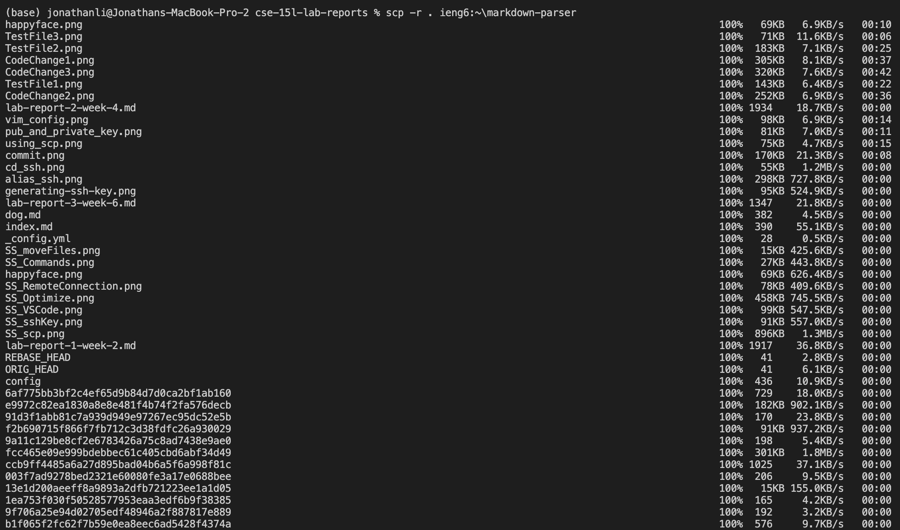
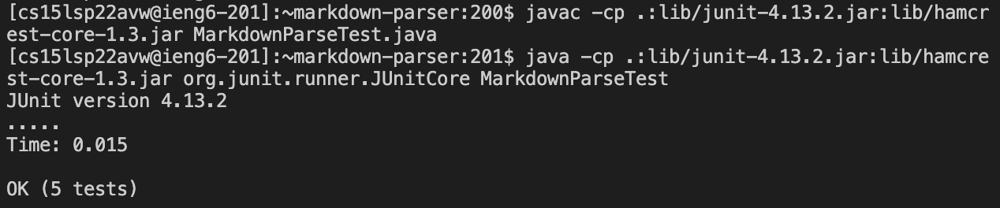
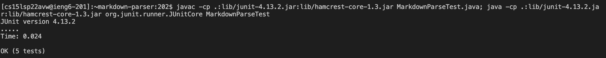

**Lab Report 3 Week 6**

# Bugs and Fixes 

## **Streamlining ssh Configuration**
- Showing .ssh/config file (step 1)

- Editing config file (step 1 part 2)

- Using the alias ssh (step 2)

- Using scp (step 3)

## **Setup Github Access from ieng6**
- Showing where the public key is on the Github Account

- Showing where the public and private key are

- Running Git commands

## **Copy whole directories with scp -r**
- Copying your whole markdown-parse directory to your ieng6 account

- Running tests remotely

- Running multiple commands in one line

That's it! Have a _nice_ day! 