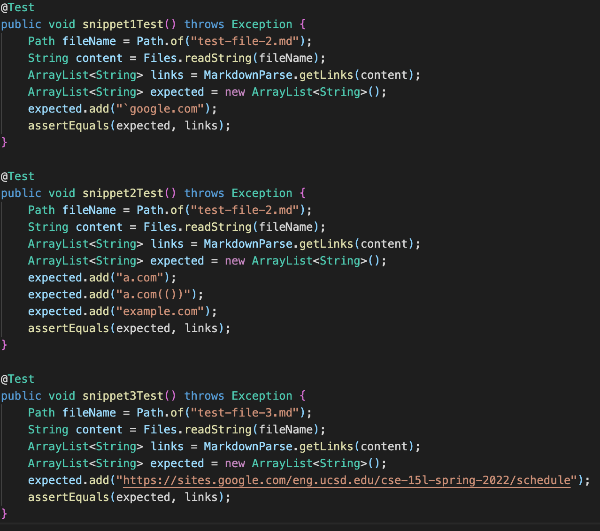
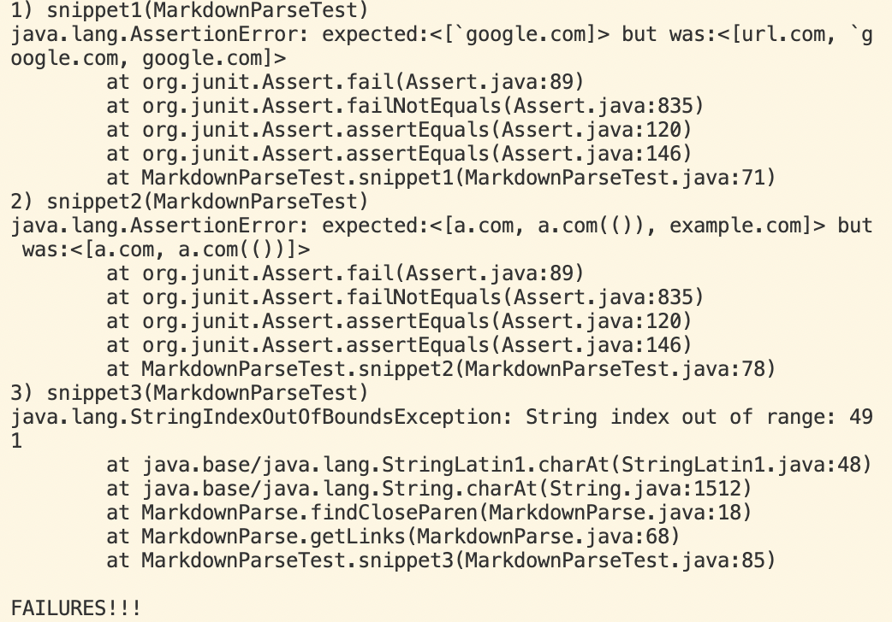

**Lab Report 4 Week 8**

# Snippets

## **Snippet #1 (Using Common Mark)**

Expected Output: 'google.com

## **Snippet #2 (Using Common Mark)**

Expected Output:  
a.com  
a.com(())  
example.com

## **Snippet #3 (Using Common Mark)**

Expected Output:  
https://sites.google.com/eng.ucsd.edu/cse-15l-spring-2022/schedule

## **Tests**

## **Test Output**

The end result was that the 3 snippet tests failed. For Snippets 1 and 2, they failed due to an Assertion Error. For Snippet 3, it failed due to a StringIndexOutOfBoundsException Error.  

## **Code Changes to Fix Problems**
1. For Snippet 1, the problem we are running into is that the code starts reading from the first opening bracket. We can change this to have it read from the last closing bracket while checking if there is a backtick before the last closing bracket. 
2. For Snippet 2, the problem that is occuring is that our code is still attempting to run when there is no closing bracket to each opening bracket. We can use the indexOf method along with a while loop to find the last closing bracket and begin reading from there to address the problem.  
3. For Snippet 3, the problem is that the program is not acconut or line breaks. To account for this, we can use indexOf to check that all pairs of brackets exist regardless of line breaks. 

That's it! Have a _nice_ day! 

