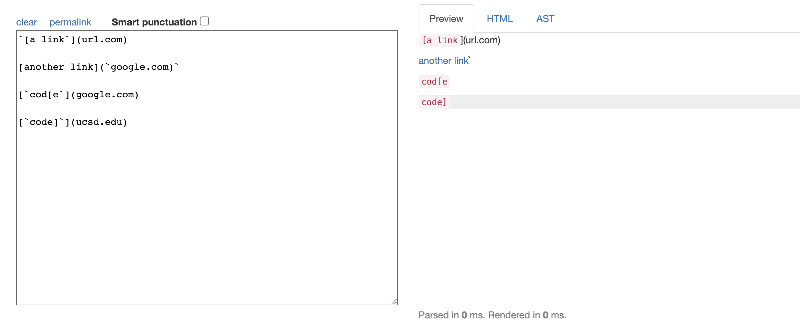
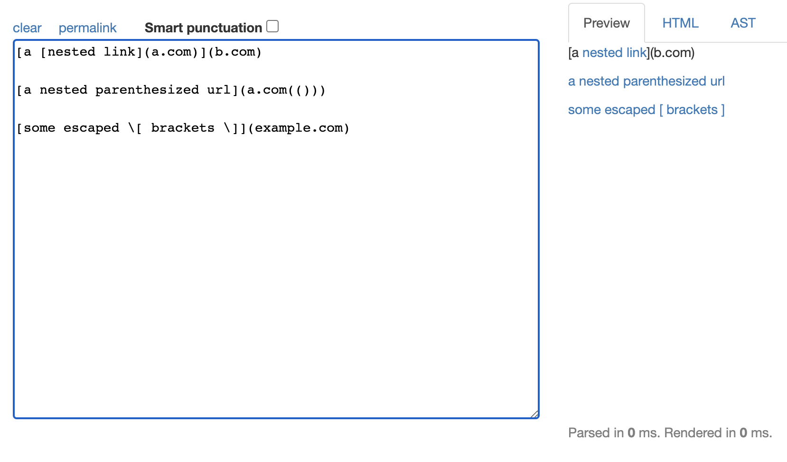
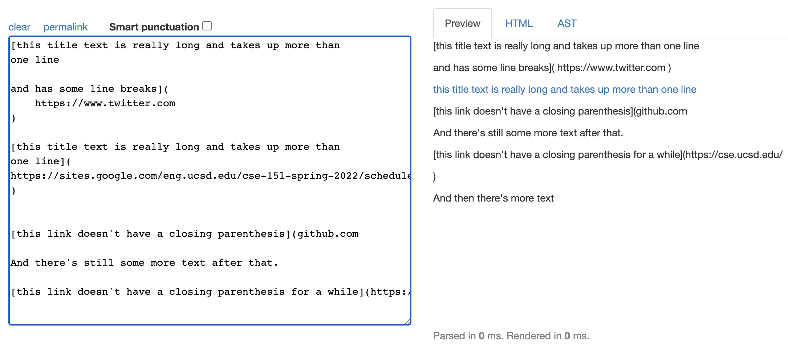

**Lab Report 4 Week 8**

# Snippets

## **Snippet #1 (Using Common Mark)**

Expected Output: 'google.com

## **Snippet #2 (Using Common Mark)**

Expected Output:  
a.com  
a.com(())  
example.com

## **Snippet #3 (Using Common Mark)**

Expected Output:  
https://sites.google.com/eng.ucsd.edu/cse-15l-spring-2022/schedule

That's it! Have a _nice_ day! 