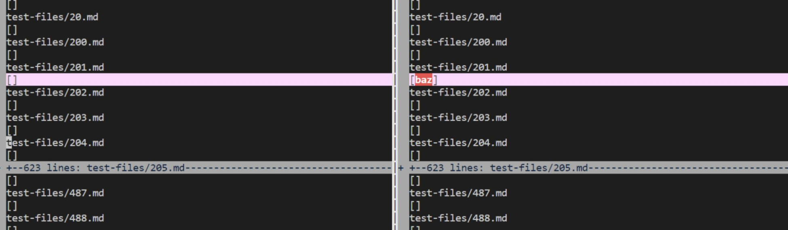
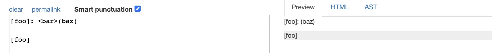
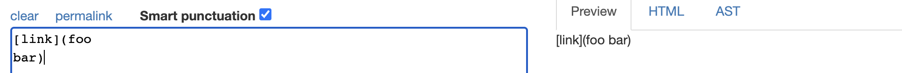
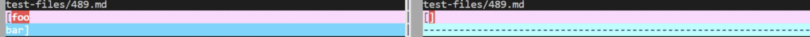

**Lab Report 5 Week 10**

## **Finding Tests with Different Results Using Vimdiff**

Expected Output: 'google.com

Using vimdiff, I compared the test outputs for the two repositories. I chose to use test files 201 and 489.

Link to [Test File 201](https://github.com/nidhidhamnani/markdown-parser/blob/main/test-files/201.md)  
Link to [Test File 489](https://github.com/nidhidhamnani/markdown-parser/blob/main/test-files/489.md)

## **Test 201 Expected Output versus Actual Outputs**

Expected Output: []  
Provided Repo Output (Incorrect):  
[baz]  
My Repo (Correct): []  

## **Test 489 Expected Output versus Actual Outputs**

Expected Output: []  
Provided Repo Output (Incorrect):  
[foo  
bar]  
My Repo (Correct): []  

That's it! Have a _nice_ day! 
